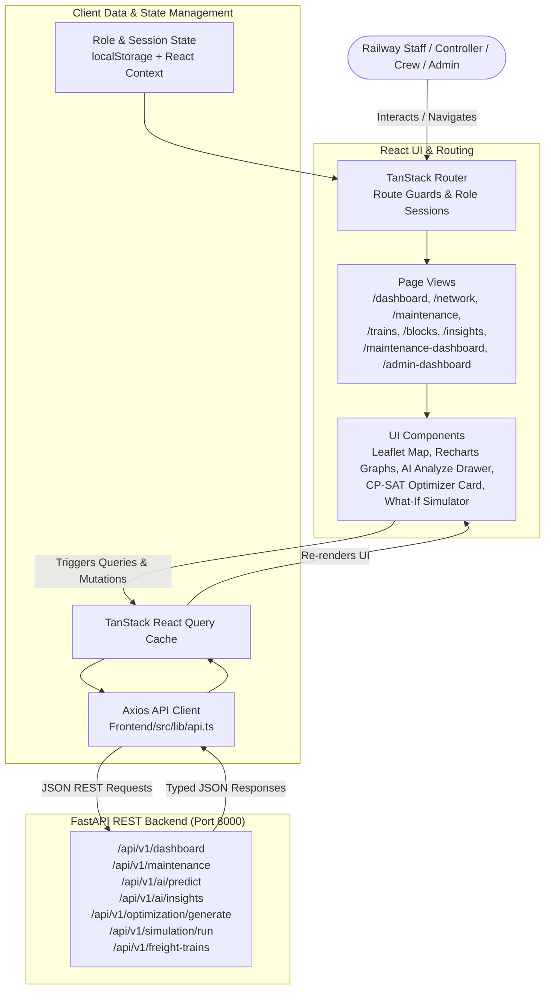

# PlanRail Frontend — User Interface & Judge Guide

> **Problem Statement**: SIH 2026 — **SIH26027**: *AI-Powered Automatic Block Planning to Maximize Asset Availability for Train Operations on Indian Railways*  
> **Corridor**: Delhi–Agra Main Line (18 Stations, 17 Sections, 85 Assets, 150 Maintenance Orders, 24 Passenger Services, 36 Freight Movements)  
> **Frontend Stack**: Modern Single-Page Application (SPA) built on **React 18**, **TypeScript**, **TanStack Router**, **Tailwind CSS**, **Recharts**, and **React-Leaflet**

---

## 1. Frontend Overview

### What is the Frontend?
The PlanRail frontend is the **operational command center** through which Indian Railways personnel interact with the underlying AI models and optimization solvers. It provides intuitive, role-tailored dashboards designed specifically for:
1. **Section Controllers**: Monitoring corridor occupancy, generating automated block plans, running What-If scenario simulations, and analyzing train traffic pressure.
2. **Maintenance Crews**: Inspecting assigned departmental work orders, checking asset degradation, and triggering on-demand AI risk analysis.
3. **Chief Administrators**: Inspecting system health, infrastructure inventories, AI model connection status, and solver telemetry.

### Technology Stack
* **React 18 & TypeScript**: Component-driven reactive UI architecture with strict end-to-end type safety against backend schemas.
* **TanStack Router / TanStack Query**: Declarative client-side routing, automated route protection, and asynchronous query caching with automatic background refetching.
* **Tailwind CSS & Radix UI Primitives**: Design system utilizing Indian Railways themed dark-mode glassmorphism (`#0B132B`, `#1C2541`, `#3A506B`, `#48CAE4`).
* **Recharts**: Responsive visualization engine for corridor risk distributions, traffic pressure curves, and comparative What-If delta charts.
* **React-Leaflet & Leaflet**: Interactive geospatial map rendering all 18 stations and 17 track sections with live asset drilldowns.
* **Axios**: Typed HTTP REST client communicating with the FastAPI backend at `http://localhost:8000/api/v1`.

---

## 2. Frontend Architecture



---

## 3. Complete Page & Route Documentation

| Route | Page Name | Primary User Role | Key Components & Operations | Backend Endpoints Called |
| :--- | :--- | :--- | :--- | :--- |
| `/` | **Login / Role Selector** | All Personas | Role cards for Controller, Maintenance Crew, and Admin with demo credential shortcuts. | Client-side Session State |
| `/dashboard` | **Controller Dashboard** | Section Controller | Live KPI cards, section occupancy bar, hourly traffic pressure chart, AI priority queue, quick action shortcuts. | `GET /api/v1/dashboard`<br>`GET /api/v1/maintenance`<br>`GET /api/v1/traffic-windows` |
| `/network` | **Railway Network** | Controller & Admin | Interactive Leaflet corridor map (199.3 km), 18 station markers, 17 track sections, asset association drilldown. | `GET /api/v1/stations`<br>`GET /api/v1/sections`<br>`GET /api/v1/assets` |
| `/maintenance` | **Maintenance Queue** | Crew & Controller | Paginated table of 150 requests, department/severity filters, search bar, **AI Analyze Drawer** with XGBoost & SHAP. | `GET /api/v1/maintenance`<br>`POST /api/v1/ai/predict` |
| `/trains` | **Trains & Freight** | Controller & Admin | **Passenger Services Tab** (24 Express schedules) & **Freight Planning Movements Tab** (36 synthetic freight records). | `GET /api/v1/trains`<br>`GET /api/v1/freight-trains`<br>`GET /api/v1/trains/{id}/schedule` |
| `/blocks` | **Block Planning & What-If** | Section Controller | **CP-SAT Optimizer Card** (triggers solver, renders scheduled blocks) + **What-If Simulation Engine** (Traffic +20%, Emergency). | `GET /api/v1/blocks`<br>`POST /api/v1/optimization/generate`<br>`POST /api/v1/simulation/run` |
| `/insights` | **AI Insights** | Controller & Crew | Corridor risk distribution pie chart, department workload ranking, XGBoost status badge, top SHAP drivers, action queue. | `GET /api/v1/ai/insights` |
| `/maintenance-dashboard` | **Maintenance Dashboard** | Maintenance Crew | Department-specific work order queue, urgent asset health cards, overdue tracker, quick AI analysis. | `GET /api/v1/maintenance`<br>`GET /api/v1/assets`<br>`POST /api/v1/ai/predict` |
| `/admin-dashboard` | **Admin Dashboard** | Chief Administrator | System health indicators, SQLite/PostgreSQL connection telemetry, database entity counts, AI and solver status. | `GET /api/v1/health`<br>`GET /api/v1/health/db`<br>`GET /api/v1/dashboard` |

---

## 4. Role-Based Login & Session Handling

The landing page (`/`) provides a clean role-selection experience:

1. **Role Cards**:
   * **Section Controller** (`controller` / `controller.control`): Access to full corridor control, CP-SAT block planning, What-If simulation, and train timetables.
   * **Maintenance Crew** (`crew.engineering`, `crew.signals`, `crew.electrical`): Focused on departmental work orders, asset condition, and task-level AI analysis.
   * **System Admin** (`admin.control` / `AdminPass123!`): Access to system health, database metrics, and configuration audits.
2. **Session Persistence**: Active user credentials and roles are stored in browser session storage and React Context, ensuring active routes persist across page refreshes.
3. **Route Protection**: If a user attempts to access `/admin-dashboard` while logged in as Maintenance Crew, the router seamlessly redirects them to their authorized view.
4. **Clean Logout**: Clicking the **Sign out** button in the sidebar or top header immediately destroys the local token and returns the user to `/`.

---

## 5. Controller Dashboard (`/dashboard`)

The Section Controller dashboard provides real-time situational awareness across the 199.3 km corridor:

```text
┌─────────────────────────────────────────────────────────────────────────────┐
│  PLANRAIL CONTROLLER DASHBOARD — DELHI–AGRA CORRIDOR (NDLS–AGC)             │
├───────────────┬───────────────┬───────────────┬───────────────┬─────────────┤
│ TOTAL STATIONS│ TRACK SECTIONS│ ACTIVE ASSETS │ PENDING TASKS │ TRAIN FLEET │
│      18       │      17       │      85       │      150      │ 24 Pax / 36F│
├───────────────┴───────────────┴───────────────┴───────────────┴─────────────┤
│ [Corridor Section Occupancy Map]  NDLS ━━━ NZM ━━━ FDB ━━━ PWL ━━━ MTJ ━━━ AGC│
├──────────────────────────────────────────────┬──────────────────────────────┤
│ Hourly Passenger & Freight Traffic Pressure  │ High-Priority AI Action Queue│
│ [Recharts Area Chart: 00:00 to 23:00]        │ 1. MR0001 - Track Welding   │
│ Peak Windows: 08:00-11:00 & 17:00-20:00      │ 2. MR0024 - Point Machine   │
│ Low Traffic Maintenance Slot: 01:00-05:00    │ 3. MR0058 - OHE Catenary    │
└──────────────────────────────────────────────┴──────────────────────────────┘
```

* **Data Sourcing**: Data is dynamically fetched via `api.dashboard()`, `api.maintenance()`, and `api.trafficWindows()`.
* **Actions Available**: The controller can click any maintenance item to open the AI detail drawer, navigate directly to **Block Planning** to generate a schedule, or test a What-If scenario.

---

## 6. Maintenance AI Analyze Drawer (`/maintenance`)

When a maintenance crew member or controller clicks on any request in the maintenance table (e.g. `MR0001` or `MR0024`), the interactive **AI Analyze Drawer** slides open from the right:

```text
┌─────────────────────────────────────────────────────────┐
│  AI DECISION SUPPORT — REQUEST #MR0001                  │
├─────────────────────────────────────────────────────────┤
│  Asset: AST0001 (Turnout Point Machine #4)              │
│  Location: Section SEC001 (NDLS - NZM)                  │
│  Department: S&T (Signalling & Telecom)                 │
├─────────────────────────────────────────────────────────┤
│  AI FAILURE RISK EVALUATION                             │
│  Probability: 49.65%  [══════════════░░░░░░░░]          │
│  Risk Category: MEDIUM (Decision Threshold: 56.84%)     │
│  Model Status: XGBOOST_TRAINED_MODEL                    │
├─────────────────────────────────────────────────────────┤
│  TOP SHAP EXPLAINABILITY DRIVERS                        │
│  ▲ High Defect Severity: 5/5 (+0.42 log-odds)           │
│  ▲ Overdue Status: 6 Days Overdue (+0.28 log-odds)      │
│  ▲ Heavy Freight Tonnage Wear: 38% (+0.19 log-odds)     │
├─────────────────────────────────────────────────────────┤
│  HARMONIZED 5-FACTOR PRIORITY SCORE                     │
│  Score: 75.3 / 100  [HIGH OPERATIONAL PRIORITY]         │
│  Formula: 30% Sev + 25% Crit + 20% Ovd + 15% Risk + 10% Traf
├─────────────────────────────────────────────────────────┤
│  CORRIDOR TRAFFIC CONTEXT                               │
│  Section Density: 4 Pax Trains/hr, 2 Freight Rakes/hr  │
│  Recommended Possession: Window W002 (02:00 - 06:00)    │
└─────────────────────────────────────────────────────────┘
```

* **No Hardcoded Values**: The probability, category, SHAP drivers, priority score, and recommendations are returned directly from the backend's `POST /api/v1/ai/predict` endpoint.

---

## 7. Trains & Freight Planning (`/trains`)

This view provides complete visibility into both passenger timetables and synthetic freight planning movements:

### 1. Passenger / Service Trains Tab
* **Fleet**: 24 express passenger services including Vande Bharat Express, Gatimaan Express, Bhopal Shatabdi, and Taj Express.
* **Interactive Timetable**: Clicking any train expands its station-by-station stop sequence (`GET /api/v1/trains/{id}/schedule`) with arrival, departure, and halt times.

### 2. Freight Planning Movements Tab
* **Fleet**: 36 synthetic freight movements (`FT-DA-001` to `FT-DA-036`) covering POL, Coal, Container, Steel, Fertilizer, and Cement.
* **Badges & Metadata**: Displays origin/destination station codes, planned entry/exit times, load tonnage (e.g. `3,850 T`), and priority level (`Critical`, `High`, `Medium`).
* **Provenance Drawer**: Clicking a freight movement opens a detail modal displaying data provenance tags (`SIMULATED_BY_PLANRAIL`) and research references.

---

## 8. Automatic Block Planning & What-If Simulation (`/blocks`)

This is the primary operational module for **SIH26027**:

### 1. Google OR-Tools CP-SAT Block Generation
1. The user selects a target planning date (e.g., `2026-09-14`) and clicks **Generate Optimization Plan**.
2. The UI sends a `POST /api/v1/optimization/generate` request to the backend.
3. In under 50 milliseconds, the Google OR-Tools CP-SAT solver computes a conflict-free schedule and returns the generated block possessions.
4. The frontend renders the resulting possessions as interactive cards showing scheduled section, time window, duration, and grouped multi-task assignments.

### 2. Real-Time What-If Simulation Engine
Controllers can test operational disruptions using the interactive scenario selector:
* **`Traffic +20%`**: Evaluates schedule resilience against a sudden surge in passenger and freight train density.
* **`Emergency Maintenance`**: Injects an unscheduled emergency track defect, evaluating how the solver accommodates the emergency block without violating safety constraints.
* **`Remove Maintenance Window`**: Simulates sudden window closure (e.g., VIP train passage), displaying which tasks were shifted to backup windows vs. unscheduled.
* **Visual Delta Cards**: Recharts graphs and comparative KPI cards display exact deltas ($\Delta$ Scheduled Tasks, $\Delta$ Train Exposure, $\Delta$ Objective Score) alongside an AI-generated factual explanation.

---

## 9. Corridor AI Insights (`/insights`)

The AI Insights page aggregates intelligence across all 150 maintenance requests on the corridor:
* **Corridor Health Overview**: Total requests analyzed, active ML model badge (`XGBOOST_TRAINED_MODEL`), and average corridor risk score.
* **Risk Distribution Graph**: Recharts Donut chart visualizing Low, Medium, High, and Critical risk proportions.
* **Department Workload Breakdown**: Bar chart comparing backlog across Engineering (Civil), Signalling (S&T), and Electrical (TRD).
* **Top Global SHAP Drivers**: Ranked list of corridor-wide failure causes (e.g. Asset Age > 15 yrs, High Heavy-Haul Freight Share).
* **Corridor Recommendation Banner**: Natural language operational advisory generated from active corridor bottleneck analysis.

---

## 10. Component-by-Component Map

| Component File | Location in Codebase | Purpose | APIs Consumed |
| :--- | :--- | :--- | :--- |
| `operations-pages.tsx` | [`Frontend/src/components/operations-pages.tsx`](file:///Users/arpitbhardwaj/Desktop/PlanRail/Frontend/src/components/operations-pages.tsx) | Core operational views (Dashboard, Maintenance, Trains, Freight, Blocks, What-If). | `/api/v1/dashboard`<br>`/api/v1/maintenance`<br>`/api/v1/trains`<br>`/api/v1/freight-trains`<br>`/api/v1/blocks`<br>`/api/v1/optimization/generate`<br>`/api/v1/simulation/run` |
| `insights-page.tsx` | [`Frontend/src/components/insights-page.tsx`](file:///Users/arpitbhardwaj/Desktop/PlanRail/Frontend/src/components/insights-page.tsx) | Corridor AI analytics, risk distributions, SHAP driver charts, high-attention task queue. | `GET /api/v1/ai/insights` |
| `network-leaflet.tsx` | [`Frontend/src/components/network-leaflet.tsx`](file:///Users/arpitbhardwaj/Desktop/PlanRail/Frontend/src/components/network-leaflet.tsx) | Interactive geospatial Leaflet map of the 199.3 km Delhi–Agra rail corridor. | `GET /api/v1/stations`<br>`GET /api/v1/sections`<br>`GET /api/v1/assets` |
| `maintenance-dashboard.tsx` | [`Frontend/src/components/maintenance-dashboard.tsx`](file:///Users/arpitbhardwaj/Desktop/PlanRail/Frontend/src/components/maintenance-dashboard.tsx) | Dedicated maintenance crew workspace with departmental task queues. | `GET /api/v1/maintenance`<br>`GET /api/v1/assets`<br>`POST /api/v1/ai/predict` |
| `admin-dashboard.tsx` | [`Frontend/src/components/admin-dashboard.tsx`](file:///Users/arpitbhardwaj/Desktop/PlanRail/Frontend/src/components/admin-dashboard.tsx) | System diagnostics, database row count audits, AI model status, solver health. | `GET /api/v1/health`<br>`GET /api/v1/health/db`<br>`GET /api/v1/dashboard` |
| `api.ts` | [`Frontend/src/lib/api.ts`](file:///Users/arpitbhardwaj/Desktop/PlanRail/Frontend/src/lib/api.ts) | Centralized Axios HTTP client with typed query wrappers and error formatters. | All Backend Endpoints |
| `types.ts` | [`Frontend/src/lib/types.ts`](file:///Users/arpitbhardwaj/Desktop/PlanRail/Frontend/src/lib/types.ts) | TypeScript interfaces mirroring backend Pydantic schemas. | N/A (Type Definitions) |

---

## 11. Real Data vs. Static UI Elements

PlanRail enforces a strict boundary between operational data and UI framing:

* **Real Backend Data**:
  * Stations, track sections, and coordinates (18 stations, 17 sections).
  * Asset health, condition scores, and installation dates (85 assets).
  * Maintenance work orders, overdue days, and severity (150 requests).
  * Passenger timetables and synthetic freight movements (24 passenger, 36 freight).
  * AI failure probabilities, risk categories, and SHAP drivers (XGBoost + SHAP).
  * Optimized maintenance block possessions (Google OR-Tools CP-SAT).
  * What-If simulation deltas and scenario comparisons.
* **Static UI Elements**:
  * Section titles, navigation icons, table column headers, and Indian Railways logos.
  * Empty-state placeholder messages (e.g. *"No freight records match the current filter"*).
  * Animated skeleton loading placeholders shown during asynchronous fetch.

---

## 12. Complete 3-Role User Journeys

### Flow A: Section Controller
1. **Login**: Authenticate as **Section Controller** from `/`.
2. **Dashboard**: Review corridor KPI counters, section track occupancy, and high-priority maintenance items.
3. **Trains & Freight**: Verify express train timetables, switch to **Freight Planning Movements** to check heavy freight tonnage rakes.
4. **Block Planning**: Open `/blocks`, click **Generate Optimization Plan** $\rightarrow$ CP-SAT solver generates conflict-free block possessions.
5. **What-If Simulation**: Test the **Traffic +20%** scenario to observe train exposure deltas and solver reallocation.
6. **AI Insights**: Check corridor risk distributions and department workloads.
7. **Logout**: Click **Sign out** to terminate session.

### Flow B: Maintenance Crew
1. **Login**: Authenticate as **Maintenance Crew** (e.g. Engineering/Civil).
2. **Maintenance Dashboard**: Inspect urgent asset health cards and pending work orders.
3. **Maintenance Queue**: Open task `MR0001`, click **AI Analyze** $\rightarrow$ view real XGBoost failure probability, localized SHAP drivers, and 5-factor priority score.
4. **Logout**: Click **Sign out**.

### Flow C: Chief Administrator
1. **Login**: Authenticate as **System Administrator**.
2. **Admin Dashboard**: Verify System Health (`Online`), Database (`Connected`), and entity counts (18 stations, 17 sections, 85 assets, 24 trains, 36 freight, 150 maintenance requests).
3. **Network**: Inspect interactive corridor map and section asset mappings.
4. **Logout**: Click **Sign out**.

---

## 13. Frontend Directory Structure

```text
Frontend/
├── src/
│   ├── components/                  # Major feature pages and reusable UI components
│   │   ├── admin-dashboard.tsx      # Admin diagnostic dashboard
│   │   ├── maintenance-dashboard.tsx# Maintenance crew workflow dashboard
│   │   ├── insights-page.tsx        # Corridor AI insights and SHAP visualization
│   │   ├── operations-pages.tsx     # Controller dashboard, trains, freight, and blocks
│   │   ├── network-leaflet.tsx      # Geospatial Leaflet map component
│   │   └── ui/                      # Radix UI and Tailwind design system primitives
│   │
│   ├── hooks/                       # Custom React hooks (useMobile, useToast)
│   ├── lib/                         # Core libraries and clients
│   │   ├── api.ts                   # Axios REST client with error handlers
│   │   ├── types.ts                 # TypeScript type interfaces
│   │   └── utils.ts                 # ClassName merger (cn) and formatting utilities
│   │
│   ├── routes/                      # TanStack Router file-based route tree
│   │   ├── __root.tsx               # Root layout, navigation sidebar, and role header
│   │   ├── index.tsx                # Role-based login and authentication entry
│   │   ├── dashboard.tsx            # Controller dashboard route
│   │   ├── network.tsx              # Corridor network map route
│   │   ├── maintenance.tsx          # Maintenance queue route
│   │   ├── trains.tsx               # Passenger & freight trains route
│   │   ├── blocks.tsx               # Block planning & What-If simulation route
│   │   ├── insights.tsx             # AI insights route
│   │   ├── maintenance-dashboard.tsx# Maintenance crew route
│   │   └── admin-dashboard.tsx      # Admin diagnostics route
│   │
│   ├── routeTree.gen.ts             # Auto-generated TanStack route tree
│   ├── router.tsx                   # Client router initialization
│   └── styles.css                   # Tailwind CSS global styles and dark theme tokens
│
├── package.json                     # Frontend dependencies and scripts
└── vite.config.ts                   # Vite build configuration with TanStack Start plugin
```

---

## 14. Verification & Production Build

The frontend build has been verified and generates clean production client and server bundles:

```bash
# Execute production build from the Frontend directory:
npm run build
```

* **Build Output**: `✓ built in 212ms` (Nitro Cloudflare / Node worker generated in `.output/public` and `.output/server` with 0 errors).
* **Live Browser Testing**: End-to-end user journeys for Controller, Maintenance Crew, and Admin roles tested with interactive modals, Leaflet map pan/zoom, and live API connectivity.

---

## 15. 🎤 2–3 Minute Frontend Speaking Script for Judges

*(Memorize and use this natural script during your SIH presentation)*

> *"Respected judges, welcome to the user experience demonstration of PlanRail.*
>
> *Our frontend is built with **React 18**, **TypeScript**, and **Tailwind CSS**, designed specifically around the operational needs of Indian Railways personnel.*
>
> *On our landing screen, you will see that PlanRail supports **three distinct role-based personas**: the Section Controller, the Maintenance Crew, and the Chief Administrator.*
>
> *First, let's look at the **Section Controller Experience**. When a controller logs in, they are greeted by a comprehensive command center for the 199-kilometer **Delhi–Agra corridor**. They see real-time KPI cards, an interactive section track map, hourly traffic pressure curves, and our AI high-priority queue. In our **Trains & Freight module**, the controller can inspect 24 express passenger timetables—like the Vande Bharat and Gatimaan Express—alongside 36 freight movements with live tonnage and commodity tracking.*
>
> *Next, let's look at our **Automatic Block Planning & What-If Module**. With a single click on 'Generate Optimization Plan', our frontend calls the Google OR-Tools CP-SAT solver. In less than 50 milliseconds, the solver returns conflict-free maintenance possessions that pack compatible civil and electrical tasks into shared track windows. Controllers can also test **What-If scenarios**—such as a 20% traffic surge or emergency maintenance—and instantly view visual delta graphs showing how the plan adapts.*
>
> *Now, switching to the **Maintenance Crew View**, field engineers have their own tailored dashboard. In the maintenance queue of 150 tasks, clicking **AI Analyze** opens our intelligence drawer. Here, the crew sees the real **XGBoost failure probability**, our domain-calibrated **5-factor priority score**, and the top mathematical **SHAP drivers**—giving field staff immediate explainability before starting track work.*
>
> *Finally, our **AI Insights View** provides corridor-wide predictive analytics and department workload distributions.*
>
> *Every data point you see is live, type-safe, and connected directly to our FastAPI backend. Thank you!"*
