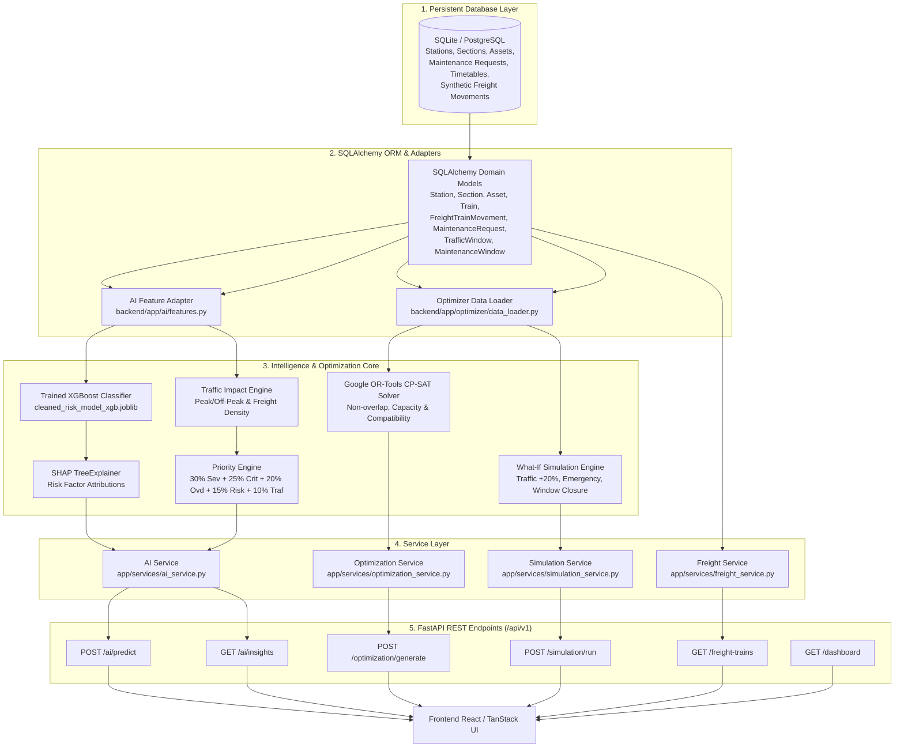
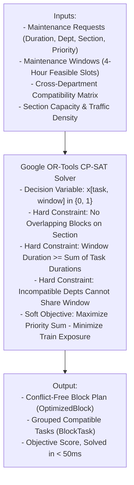

# PlanRail Backend — Technical Architecture & Judge Guide

> **Problem Statement**: SIH 2026 — **SIH26027**: *AI-Powered Automatic Block Planning to Maximize Asset Availability for Train Operations on Indian Railways*  
> **Corridor**: Delhi–Agra Main Line (18 Stations, 17 Track Sections, 199.3 km, Double-Line Electrified BG, 160 km/h semi-high speed)  
> **Backend Service**: High-performance FastAPI REST Engine + Google OR-Tools CP-SAT Optimizer + XGBoost ML Classifier + SHAP Explainability Pipeline

---

## 1. Backend Overview

### What is the Backend?
The PlanRail backend is the **decision-intelligence and optimization core** of the application. While the frontend displays interactive maps, charts, and control dashboards for railway staff, the backend handles the complex mathematics, machine learning inference, train timetabling conflict resolution, and constraint-based scheduling.

### Why does PlanRail need a Backend?
Indian Railways is one of the busiest rail networks in the world. Scheduling track maintenance blocks cannot be done manually without risking severe train delays or safety hazards. The backend:
1. **Evaluates Infrastructure Risk**: Ingests real-time asset condition, defect history, and traffic wear to predict failure probability using machine learning.
2. **Harmonizes Operational Priority**: Combines engineering severity, asset criticality, overdue days, ML failure risk, and corridor traffic exposure into a single standardized priority score.
3. **Automates Block Scheduling**: Uses mathematical constraint programming (Google OR-Tools CP-SAT) to search through thousands of candidate maintenance windows and pack compatible tasks into conflict-free maintenance possessions.
4. **Runs Real-Time "What-If" Simulations**: Allows controllers to simulate emergency maintenance, 20% traffic spikes, or window closures in milliseconds without touching live production data.

### How does it communicate with the Frontend?
The backend exposes a clean, typed RESTful JSON API (`/api/v1/*`) over HTTP/HTTPS with CORS configuration and strict Pydantic schema validation.

---

## 2. Backend Technology Stack

| Technology | Purpose in PlanRail |
| :--- | :--- |
| **Python 3.11+** | Core programming language for data pipelines, AI models, and solver bindings. |
| **FastAPI** | Asynchronous, high-throughput web framework providing automated OpenAPI documentation and dependency injection. |
| **SQLAlchemy 2.0** | Object-Relational Mapper (ORM) providing type-safe database queries across SQLite and PostgreSQL. |
| **Pydantic v2** | Strict data validation, request parsing, and response serialization schemas. |
| **Google OR-Tools (CP-SAT)** | Industrial-grade Constraint Programming solver for discrete combinatorial block planning. |
| **XGBoost (`xgboost.XGBClassifier`)** | Gradient-boosted decision tree classifier predicting asset failure probabilities across 11 features. |
| **SHAP (`shap.TreeExplainer`)** | Game-theoretic explainability engine computing exact feature contribution vectors for every AI decision. |
| **SQLite / PostgreSQL (Supabase)** | Relational storage for corridor topography, timetables, synthetic freight movements, assets, and maintenance queues. |
| **Joblib / Scikit-Learn** | ML artifact serialization, pre-warming singletons, and threshold evaluation pipelines. |

---

## 3. Complete Backend Architecture



---

## 4. Database Schema & Entities

The database represents the full operational topology of the **Delhi–Agra (NDLS–AGC)** corridor:

| Entity / Table | Count | Operational Purpose in Indian Railways Planning |
| :--- | :---: | :--- |
| `stations` | **18** | Stations along the corridor (NDLS, NZM, FDB, PWL, MTJ, AGC, etc.) with geo-coordinates and km markers. |
| `railway_sections` | **17** | Contiguous track blocks between stations with electrification, line count, and traffic classification. |
| `assets` | **85** | Physical railway infrastructure (Track, OHE Catenary, Point Machines, Electronic Interlocking, Signals). |
| `maintenance_requests` | **150** | Active maintenance work orders across Engineering (Civil), S&T (Signalling), and Electrical (TRD). |
| `trains` | **24** | Scheduled passenger express services (Vande Bharat, Gatimaan, Rajdhani, Shatabdi, Superfast, MEMU). |
| `train_schedules` | **432** | Station-by-station arrival and departure timetable stops. |
| `freight_train_movements` | **36** | Synthetic freight planning movements (`SIMULATED_BY_PLANRAIL`) with tonnage, commodity, and time windows. |
| `maintenance_windows` | **408** | Pre-identified 4-hour temporal slots across sections evaluated for feasibility and passenger/freight exposure. |
| `traffic_windows` | **408** | Hourly section occupancy counts used for baseline traffic density calculations. |
| `maintenance_history` | **300** | Past failure and repair logs used to calculate historical failure rates and MTBF. |
| `crew_availability` | **30** | Specialized maintenance teams with departmental skillsets and active working shifts. |
| `task_compatibility` / `maintenance_compatibility` | **12** | Matrix defining which departments can share a track possession concurrently (e.g. TRD + Track = Compatible). |

> **Data Provenance Note on Freight Records**:  
> The 36 freight movement records are calibrated synthetic planning scenarios (`SIMULATED_BY_PLANRAIL`) covering 2026-09-14 to 2026-09-16. They are designed to model freight traffic pressure on the Delhi–Agra corridor and are explicitly tagged with complete source references.

---

## 5. End-to-End Data Processing Flow

```text
[1. Application Database (SQLite/PostgreSQL)]
       │
       ▼ (SQLAlchemy ORM Extraction)
[2. Feature Extractor (11 Domain Indicators)]
       │
       ▼ (Passes Vector to Pre-Warmed Singleton)
[3. XGBoost Classifier (cleaned_risk_model_xgb.joblib)]
       │
       ├─────────────────────────────────┐
       ▼                                 ▼
[4. Failure Probability & Risk Score]   [5. SHAP TreeExplainer (Feature Drivers)]
       │                                 │
       ▼                                 │
[6. Traffic Impact Engine (Passenger + Freight)]
       │                                 │
       ▼                                 │
[7. Multi-Criteria Priority Engine] ◄────┘
       │
       ▼ (Priority Queue & Risk Metrics)
[8. Google OR-Tools CP-SAT Solver]
       │
       ▼ (Constraint Satisfaction & Multi-Task Packing)
[9. Generated Conflict-Free Block Plan & What-If Simulation]
       │
       ▼ (Pydantic Schema Serialization)
[10. FastAPI Response to Frontend]
```

---

## 6. Complete API Reference

All routes are served under the `/api/v1` prefix:

### 1. Health & Status
* `GET /api/v1/health`: Returns API server liveness (`{"status": "online"}`).
* `GET /api/v1/health/db`: Returns database connection status and dialect (`{"status": "connected", "database": "sqlite"}`).
* `GET /api/v1/dashboard`: Returns aggregate corridor summary (total stations, sections, assets, maintenance count, train count, pending requests).

### 2. Network & Infrastructure
* `GET /api/v1/stations`: Paginated list of stations with search filtering by name or code.
* `GET /api/v1/stations/{station_id}`: Station detail by ID or station code.
* `GET /api/v1/sections`: Paginated list of track sections with distance, line count, and electrification.
* `GET /api/v1/sections/{section_id}`: Section detail by ID.
* `GET /api/v1/assets`: Paginated assets with filters for department, asset type, section, and condition score.
* `GET /api/v1/assets/{asset_id}`: Asset detail including installation year, condition, and maintenance logs.

### 3. Maintenance Operations
* `GET /api/v1/maintenance`: Paginated list of 150 maintenance requests with filtering by department, status, severity, and section.
* `GET /api/v1/maintenance/{request_id}`: Comprehensive maintenance detail including asset specs, due date, duration, and baseline risk.

### 4. Passenger & Freight Trains
* `GET /api/v1/trains`: Timetabled passenger train services (Vande Bharat, Gatimaan, Rajdhani, etc.).
* `GET /api/v1/trains/{train_number}`: Passenger train header information.
* `GET /api/v1/trains/{train_number}/schedule`: Station-by-station arrival, departure, and halt sequence.
* `GET /api/v1/freight-trains`: Synthetic freight planning movements with commodity, tonnage, priority, and date filters.
* `GET /api/v1/freight-trains/{freight_train_id}`: Freight movement detail with simulation notes and references.

### 5. Windows & Possessions
* `GET /api/v1/maintenance-windows`: 408 pre-computed maintenance slots with traffic levels and feasibility flags.
* `GET /api/v1/traffic-windows`: Hourly section train density windows.
* `GET /api/v1/blocks`: Paginated optimized block possession records.
* `GET /api/v1/blocks/{block_id}`: Block detail including grouped tasks and assigned time window.

### 6. AI Intelligence & Decision Support
* `POST /api/v1/ai/predict`: Evaluates a specific maintenance request (`{"request_id": "MR0001"}`). Runs XGBoost ML model, SHAP explainer, traffic impact, and 5-factor priority formula.
* `GET /api/v1/ai/insights`: Evaluates all 150 corridor maintenance requests, aggregating risk distributions, department workloads, top SHAP drivers, and actionable recommendations.

### 7. Optimization & What-If Simulation
* `POST /api/v1/optimization/generate`: Triggers the Google OR-Tools CP-SAT solver to compute a conflict-free block plan for a target date.
* `POST /api/v1/simulation/run`: Runs an in-memory scenario evaluation (`TRAFFIC_PLUS_20`, `EMERGENCY_MAINTENANCE`, `REMOVE_MAINTENANCE_WINDOW`) comparing baseline vs. scenario metrics.

---

## 7. The Machine Learning AI Pipeline

### Trained Model Contract
The backend loads the real teammate ML model artifact:
* **File Location**: [`backend/app/ai/models/cleaned_risk_model_xgb.joblib`](file:///Users/arpitbhardwaj/Desktop/PlanRail/backend/app/ai/models/cleaned_risk_model_xgb.joblib)
* **Model Type**: `xgboost.sklearn.XGBClassifier`
* **Decision Threshold**: `0.5684` (Derived from ROC optimization on test validation)
* **Status Flag**: `XGBOOST_TRAINED_MODEL`

### The 11 Model Features (Strict Order)

```text
Feature 1:  condition_score        → Current health index of the asset (0.0 = Failed, 100.0 = Brand New)
Feature 2:  severity               → Engineering severity of the defect (1 = Minor to 5 = Critical)
Feature 3:  criticality            → Operational impact if asset fails (1 = Low to 5 = Systemic Corridor Block)
Feature 4:  overdue_days           → Days elapsed past the scheduled maintenance due date
Feature 5:  historical_failures    → Cumulative lifetime breakdown count for this physical asset
Feature 6:  train_density          → Passenger train count traversing this track section per hour
Feature 7:  freight_train_density  → Synthetic freight train count active on this section
Feature 8:  freight_share_percent  → Percentage of total traffic represented by heavy freight (tonnage wear)
Feature 9:  asset_age              → Years elapsed since commissioning/installation
Feature 10: maintenance_frequency  → Frequency of routine inspections per quarter
Feature 11: previous_defects       → Number of defect logs recorded in the preceding 90 days
```

### Risk Classification
* `P(Failure) < 0.35` → **Low Risk**
* `0.35 <= P(Failure) < 0.5684` → **Medium Risk**
* `0.5684 <= P(Failure) < 0.75` → **High Risk**
* `P(Failure) >= 0.75` → **Critical Risk**

---

## 8. SHAP (SHapley Additive exPlanations) Engine

Explainability is essential in railway operations; a Section Controller cannot blindly trust a black-box AI score when halting train traffic.

PlanRail integrates a native `shap.TreeExplainer` instantiated directly on the trained XGBoost tree ensemble:
1. **Computes Exact Local Marginal Contributions**: For any maintenance request, SHAP calculates the exact positive or negative log-odds shift contributed by each of the 11 features.
2. **Identifies Dominant Failure Drivers**: Automatically extracts the top 3 contributing factors (e.g., *"High Defect Severity (5/5)"*, *"Severe Overdue Status (14 days)"*, *"Heavy Freight Tonnage Share (42%)"*).
3. **Generates Structured Audit Briefings**: Synthesizes a natural language decision summary for controllers and safety auditors.

---

## 9. Freight Train Processing & Provenance

Freight trains represent heavy axial tonnage, causing significantly higher track degradation than lightweight passenger trains.

1. **Database Representation**: 36 simulated freight planning movements (`FT-DA-001` through `FT-DA-036`) across POL (Petroleum), Coal, Steel, Container, Fertilizer, and Cement.
2. **Priority Weighting**:
   * `Critical Freight` = **1.5x traffic multiplier**
   * `High Freight` = **1.2x traffic multiplier**
   * `Medium Freight` = **1.0x traffic multiplier**
3. **AI Integration**: The `features.py` adapter computes `freight_train_density` and `freight_share_percent` for every section, ensuring heavy haul traffic directly elevates maintenance urgency.
4. **Optimization Conflict Checking**: The CP-SAT solver factors freight paths into window occupancy, preventing maintenance blocks from stranding priority freight rakes.

---

## 10. Traffic Impact & 5-Factor Priority Harmonization

PlanRail computes an authoritative **Operational Priority Score (0–100)** using a domain-calibrated 5-factor weighted formula:

$$\text{Priority Score} = 0.30 \times \text{Sev} + 0.25 \times \text{Crit} + 0.20 \times \text{Ovd} + 0.15 \times \text{Risk} + 0.10 \times \text{Traf}$$

Where each factor is normalized to a 0–100 scale:
* **Severity (30%)**: Engineering defect severity ($(\text{severity} / 5) \times 100$).
* **Criticality (25%)**: Asset systemic criticality ($(\text{criticality} / 5) \times 100$).
* **Overdue (20%)**: Days overdue ($\min(100, \text{overdue\_days} \times 5)$).
* **AI Risk Score (15%)**: XGBoost failure probability ($P(\text{failure}) \times 100$).
* **Traffic Impact (10%)**: Combined passenger + weighted freight traffic pressure on the section.

### Hypothetical Example
For a point machine defect on the New Delhi–Faridabad section:
* Severity = 5/5 $\rightarrow$ Normalized = 100 $\times 0.30 = 30.0$
* Criticality = 4/5 $\rightarrow$ Normalized = 80 $\times 0.25 = 20.0$
* Overdue = 6 days $\rightarrow$ Normalized = 30 $\times 0.20 = 6.0$
* AI Risk = 72% $\rightarrow$ Normalized = 72 $\times 0.15 = 10.8$
* Traffic Impact = 85 $\rightarrow$ Normalized = 85 $\times 0.10 = 8.5$
* **Total Harmonized Priority Score = 75.3 / 100 (HIGH PRIORITY)**

---

## 11. Google OR-Tools CP-SAT Block Optimizer

The optimization engine schedules maintenance tasks into track possessions without violating safety or operational rules.



### Key Solver Constraints Enforced
1. **Section Non-Overlap**: No two maintenance possessions can occupy the same section at overlapping timestamps.
2. **Temporal Window Capacity**: The sum of durations of all tasks assigned to a window must not exceed the window's total available duration.
3. **Cross-Department Compatibility**: If two tasks share a window, their departments must be marked `COMPATIBLE` or `CONDITIONAL` in the compatibility matrix. Incompatible tasks (e.g. welding track while high-voltage OHE is energized) are strictly forbidden.
4. **Single Assignment**: Each maintenance task is scheduled at most once.

---

## 12. What-If Simulation Engine

PlanRail includes an in-memory scenario simulation engine that lets controllers test operational disruptions in real time:

1. **`TRAFFIC_PLUS_20`**: Simulates a 20% surge in passenger and freight train density. Evaluates whether existing maintenance blocks can withstand the higher train exposure penalty or if the solver reallocates blocks to lower-traffic windows.
2. **`EMERGENCY_MAINTENANCE`**: Injects an emergency work order with maximum priority ($1000.0$), forcing the solver to immediately create an emergency possession while maintaining all physical safety constraints.
3. **`REMOVE_MAINTENANCE_WINDOW`**: Simulates sudden track possession cancellation (e.g., VIP train movement or bad weather), evaluating how many scheduled tasks can be shifted to backup windows vs. unscheduled.

> **Zero DB Mutation Guarantee**: What-If simulations execute entirely in memory with deep-copied data structures, guaranteeing zero side-effects or mutations on live production records.

---

## 13. Multi-Role Backend Support

The backend supports 3 distinct operational personas:
1. **Section Controller**:
   * Real-time dashboard KPI summaries, section occupancy maps, passenger + freight train schedules.
   * Full CP-SAT block plan generation and interactive What-If simulation.
   * Corridor-level AI predictive risk distribution and action queue.
2. **Maintenance Crew**:
   * Department-specific work order queues (Civil, S&T, Electrical).
   * On-demand **AI Analyze** tool (`/api/v1/ai/predict`) providing instant failure risk, SHAP drivers, and priority context.
   * Asset condition indicators and overdue trackers.
3. **Chief Admin**:
   * System health monitoring (`/api/v1/health`, `/api/v1/health/db`).
   * Infrastructure master data inspection (Stations, Sections, Assets, Trains, Freight).
   * AI model and CP-SAT solver status verification.

---

## 14. Verification & Testing

The backend includes a comprehensive automated test suite of **103 unit and integration tests**:

```bash
# Execute the full test suite from the backend directory:
python -m unittest discover -s tests -p "test_*.py"
```

### Verified Test Results (103 / 103 PASS)
* `test_api.py` (14 tests): Health endpoints, stations, sections, assets, maintenance, trains, windows, blocks.
* `test_api_e2e.py` (6 tests): End-to-end multi-endpoint flows and serialization.
* `test_freight.py` (13 tests): 36 freight records, idempotency, date/time parsing, hourly traffic calculation, API routes.
* `test_optimizer.py` (15 tests): CP-SAT solver constraints, non-overlap, multi-task packing, compatibility rules.
* `test_optimization_service.py` (14 tests): OptimizationService generation, DB persistence, validation.
* `test_simulation_service.py` (16 tests): What-If scenarios (`TRAFFIC_PLUS_20`, `EMERGENCY_MAINTENANCE`, `REMOVE_MAINTENANCE_WINDOW`).
* `test_ai_pipeline.py` (20 tests): 11-feature extraction, priority engine weights, traffic impact calculations.
* `test_xgboost_integration.py` (5 tests): Real `.joblib` model loading, SHAP TreeExplainer drivers, `/api/v1/ai/predict`, `/api/v1/ai/insights`.

---

## 15. Backend Directory Structure

```text
backend/
├── app/
│   ├── ai/                          # Machine learning and explainability layer
│   │   ├── models/                  # Serialized ML artifacts (cleaned_risk_model_xgb.joblib)
│   │   ├── risk_model.py            # XGBoost singleton loader and inference engine
│   │   ├── explainability.py        # SHAP TreeExplainer feature importance calculator
│   │   ├── features.py              # SQLite-to-11-feature adapter
│   │   ├── traffic_impact.py        # Peak/off-peak & freight traffic disruption calculator
│   │   └── priority_engine.py       # 5-factor priority formula (30/25/20/15/10)
│   │
│   ├── api/                         # FastAPI routing layer
│   │   ├── dependencies.py          # Database session injection
│   │   └── routes/                  # Modular endpoint routers (health, dashboard, assets, etc.)
│   │
│   ├── database/                    # SQLAlchemy engine, session factory, and seeders
│   │   ├── connection.py            # SQLite/PostgreSQL engine connection and init_db()
│   │   ├── freight_loader.py        # Idempotent seeder for 36 simulated freight movements
│   │   └── base.py                  # Declarative base class
│   │
│   ├── models/                      # SQLAlchemy ORM database models
│   ├── schemas/                     # Pydantic request/response validation schemas
│   ├── optimizer/                   # Google OR-Tools CP-SAT solver and data loader
│   ├── services/                    # Business logic (AIService, OptimizationService, SimulationService, FreightService)
│   ├── config.py                    # Environment and settings configuration
│   └── main.py                      # FastAPI application entry point with lifespan handler
│
├── scripts/                         # Standalone dataset loaders and migration scripts
└── tests/                           # 103 automated unit and integration tests
```

---

## 16. 🎤 2-Minute Backend Speaking Script for Judges

*(Memorize and use this natural script during your SIH presentation)*

> *"Good morning, respected judges. I would like to walk you through the intelligence and optimization backend of PlanRail.*
>
> *At its foundation, our backend is built on **FastAPI** and **Python**, connected to an operational dataset modeling the 199-kilometer **Delhi–Agra corridor** with 18 stations, 85 assets, and 150 active maintenance requests.*
>
> *What makes PlanRail unique is how our data flows through three intelligent layers:*
>
> *First is our **AI Risk & Explainability Engine**. We extract an 11-feature telemetry vector for every maintenance request—including asset condition, overdue days, and passenger plus freight traffic wear. We pass this into our trained **XGBoost Classifier**, which predicts the asset's failure probability against an optimal decision threshold of 0.5684. But because railway controllers cannot rely on a black-box, our native **SHAP TreeExplainer** calculates the exact mathematical drivers behind every prediction—showing the controller precisely why a track or signal is at risk.*
>
> *Second is our **Freight & Multi-Criteria Priority Engine**. In addition to 24 scheduled express trains, we incorporate 36 freight movements with priority multipliers. We harmonize defect severity, asset criticality, overdue days, AI risk, and corridor traffic into a single, standardized 0-to-100 priority score.*
>
> *Third is our **Google OR-Tools CP-SAT Optimizer**. Instead of manual scheduling, our solver takes all candidate maintenance requests, evaluates 408 corridor maintenance windows, checks departmental compatibility—so track and electrical teams can safely co-utilize blocks—and generates a conflict-free block possession plan in under 50 milliseconds.*
>
> *Finally, our **What-If Simulation Service** allows the Controller to simulate emergency repairs or 20% traffic surges in memory without affecting live operations.*
>
> *Our backend is verified by **103 automated tests** and ready for deployment. Thank you!"*
