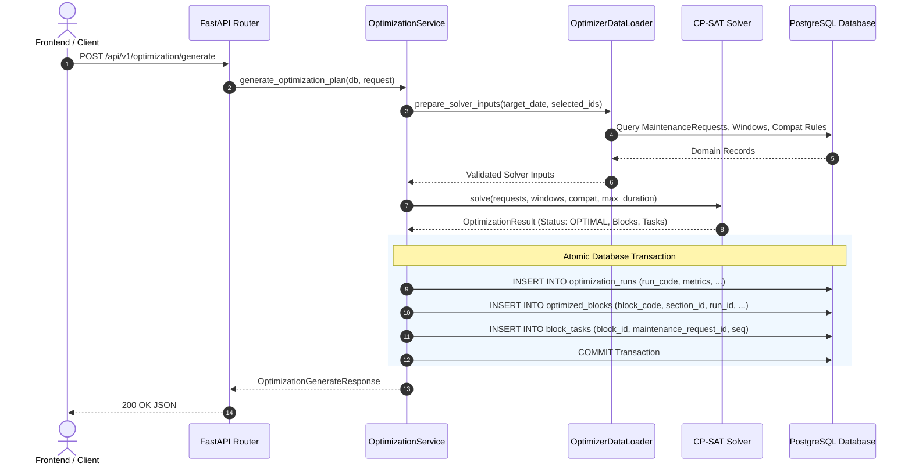

# PlanRail — Maintenance Block Optimizer API Documentation

## 1. Overview

The PlanRail Optimizer generates and persists mathematically optimized maintenance block schedules for the Delhi–Agra railway corridor using **Google OR-Tools CP-SAT**.

* **Method**: `POST`
* **Path**: `/api/v1/optimization/generate`
* **Authentication**: None (internal / session authenticated)
* **Response Type**: `application/json`

---

## 2. API Contract

### 2.1 Request Schema (`OptimizationGenerateRequest`)

```json
{
  "target_date": "2026-09-10",
  "selected_request_ids": ["MR0001", "MR0002"],
  "max_block_duration_hours": 4.0
}
```

#### Field Specifications:

| Field | Type | Required | Default | Description |
| :--- | :--- | :--- | :--- | :--- |
| `target_date` | `string (YYYY-MM-DD)` | **Yes** | — | Target operational planning date. |
| `selected_request_ids` | `array[string]` | No | `null` | Optional list of specific `request_id`s to schedule. If omitted or empty, all eligible `PENDING` requests due within 7 days are considered. |
| `max_block_duration_hours` | `float` | No | `4.0` | Maximum combined duration of maintenance tasks allowed inside a single block. |

---

### 2.2 Response Schema (`OptimizationGenerateResponse`)

```json
{
  "run_id": "RUN_20260910_103126_7094",
  "status": "OPTIMAL",
  "target_date": "2026-09-10",
  "total_requests_considered": 123,
  "scheduled_tasks_count": 31,
  "unscheduled_tasks_count": 92,
  "blocks_count": 25,
  "solve_time_ms": 55.16,
  "blocks": [
    {
      "block_id": "BLK_20260910_SEC001_01_1",
      "run_id": "RUN_20260910_103126_7094",
      "section_id": "SEC001",
      "start_time": "2026-09-10T00:00:00Z",
      "end_time": "2026-09-10T01:00:00Z",
      "duration_hours": 1.0,
      "status": "PROPOSED",
      "tasks": [
        {
          "block_task_id": "BT_1",
          "block_id": "BLK_20260910_SEC001_01_1",
          "request_id": "MR0120",
          "sequence": 1
        },
        {
          "block_task_id": "BT_2",
          "block_id": "BLK_20260910_SEC001_01_1",
          "request_id": "MR0003",
          "sequence": 2
        }
      ]
    }
  ]
}
```

---

## 3. Optimization Flow & Database Persistence



---

## 4. Idempotency & Historical Run Retention

* **Non-Destructive Execution**: Each invocation creates a distinct, timestamped `OptimizationRun` record.
* Historical blocks and previous optimization runs are **never deleted or overwritten**.
* Generated blocks are immediately discoverable through `GET /api/v1/blocks` and `GET /api/v1/blocks/{block_id}`.

---

## 5. Error Handling & HTTP Status Codes

| HTTP Status | Error Code | Cause / Remedy |
| :--- | :--- | :--- |
| **`400 Bad Request`** | `NO_ELIGIBLE_REQUESTS` | No pending maintenance requests matched the requested target date or ID list. |
| **`400 Bad Request`** | `NO_FEASIBLE_WINDOWS` | No maintenance windows with `is_feasible = true` are available on candidate sections. |
| **`400 Bad Request`** | `INFEASIBLE_PLAN` | Solver proved mathematical infeasibility under specified duration limits. |
| **`422 Unprocessable`** | `VALIDATION_ERROR` | Malformed target date string or invalid data types in request body. |
| **`500 Internal Error`** | `PERSISTENCE_TRANSACTION_FAILED` | Database constraint violation during block insertion (automatically rolled back). |

---

## 6. Known Assumptions & Operational Limitations

> [!IMPORTANT]
> **The optimizer is traffic-aware using expected train counts and traffic levels. It does not model individual train movements as decision variables.**
> Traffic impact is evaluated via section-level hourly capacity, train frequency penalties, and feasibility filters.

> [!NOTE]
> **Crew routing is currently advisory because the available crew dataset does not provide spatial/depot assignment information.**
> Crew availability constraints remain advisory at the departmental level and are not enforced as hard spatial routing constraints to prevent artificial infeasibility.
