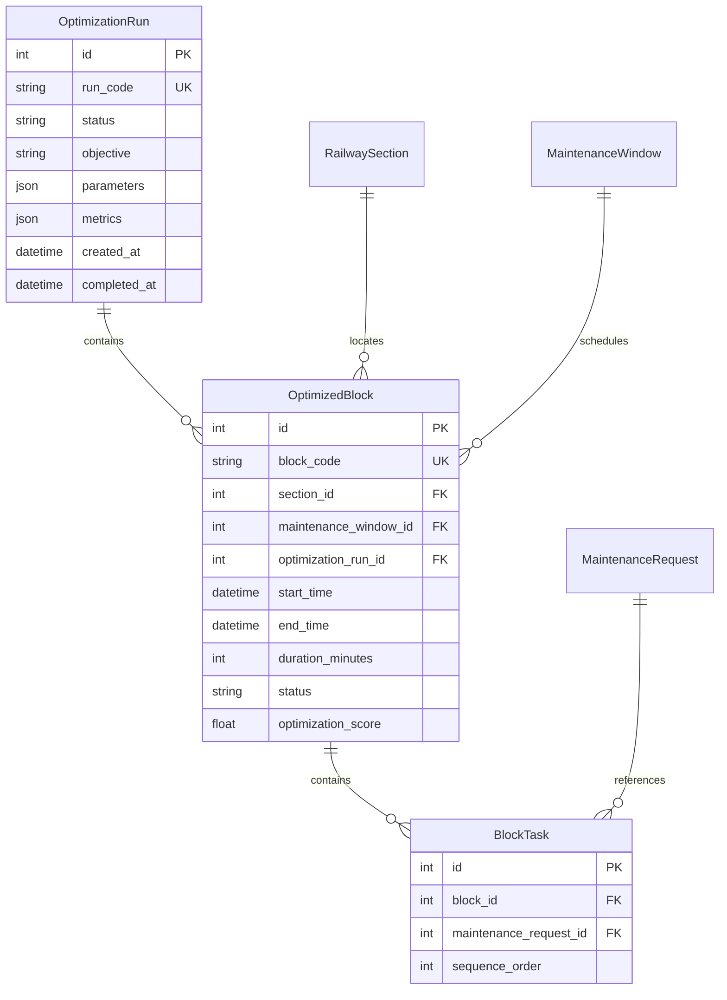

# PlanRail — OR-Tools Maintenance Block Optimizer Design & Contract Audit

## 1. Executive Summary

This document establishes the formal design, mathematical formulation, data bindings, API contract, and implementation plan for PlanRail's Google OR-Tools CP-SAT optimization engine.

PlanRail optimizes railway maintenance scheduling by solving a multi-criteria constraint satisfaction problem: maximizing the execution of critical and overdue maintenance tasks while minimizing train disruption, block overhead, and department incompatibility.

---

## 2. Maintenance Request Entity Audit

### 2.1 Schema & Database Mapping (`maintenance_requests`)
From `app/models/maintenance.py` and `app/schemas/domain.py`:

| Field | Type | DB Column / Constraint | Optimizer Usage |
| :--- | :--- | :--- | :--- |
| `id` | `int` | PK, autoincrement | Internal relational join key for `BlockTask` |
| `request_id` | `str` | VARCHAR(30), unique, indexed | Public identifier (e.g. `"MR0001"`) |
| `task_code` | `str` (Optional) | VARCHAR(30) | Reference code for work order |
| `asset_id` | `str` | FK to `assets.asset_id` | Identifies specific track, signal, or OHE asset |
| `section_id` | `str` | FK to `railway_sections.section_id` | **Primary Spatial Binding**: task must be scheduled on this section |
| `department` | `str` | VARCHAR(50) | **Compatibility Binding**: Used for multi-department bundling rules |
| `asset_type` | `str` (Optional) | VARCHAR(50) | Contextual classification |
| `maintenance_type`| `str` | VARCHAR(100) | Work description (e.g., Track Tamping, Relay Test) |
| `severity` | `float` | FLOAT (1.0 – 5.0) | Multiplier for task urgency |
| `criticality_score`| `float` | FLOAT (1.0 – 5.0) | Multiplier for asset criticality |
| `duration_hours` | `float` | FLOAT (e.g., 1.5, 2.0, 3.0) | **Temporal Consumption**: Capacity consumed within maintenance window |
| `created_date` | `datetime` | TIMESTAMP WITH TIME ZONE | Creation timestamp |
| `due_date` | `datetime` | TIMESTAMP WITH TIME ZONE | **Deadline**: Target completion deadline |
| `overdue_days` | `int` | INTEGER (default 0) | Escalation bonus: increases priority if > 0 |
| `baseline_risk_score`| `float` | FLOAT | Initial risk assessment score |
| `priority_score` | `float` | FLOAT (AI or calculated) | Main reward weight in objective function |
| `risk_score` | `float` | FLOAT (AI predicted) | Secondary reward weight for risk mitigation |
| `traffic_impact_score`| `float` | FLOAT | Estimated operational disruption weight |
| `crew_required` | `int` | INTEGER (default 1) | Advisory resource demand |
| `status` | `str` | VARCHAR(50), default "PENDING" | Only `"PENDING"` requests are candidate inputs |

---

## 3. Maintenance Window & Traffic Structure

### 3.1 Maintenance Windows (`maintenance_windows`)
From `app/models/block.py` and `app/schemas/domain.py`:

* `window_id`: String (e.g. `"MW_DEL_TKD_01"`), unique identifier.
* `section_id`: String (FK to `railway_sections.section_id`).
* `start_hour`: Integer ($0 \le h \le 23$).
* `start_time`: Time/String (e.g. `"01:00:00"`).
* `end_time`: Time/String (e.g. `"05:00:00"`).
* `expected_train_count`: Integer (expected trains scheduled in window).
* `traffic_level`: String (`"LOW"`, `"MEDIUM"`, `"HIGH"`).
* `is_feasible`: Boolean (`True` if suitable for maintenance blocks, `False` during heavy traffic peaks).
* `window_reason`: Optional reason string (e.g. `"Night traffic lull"`).

### 3.2 Traffic Windows (`traffic_windows`)
* `traffic_window_id`: String (e.g. `"TW_DEL_TKD_H01"`).
* `section_id`: String (FK to `railway_sections.section_id`).
* `hour`: Integer ($0 \le h \le 23$).
* `train_count`: Integer.
* `traffic_level`: String (`"LOW"`, `"MEDIUM"`, `"HIGH"`).

### 3.3 Traffic Penalty Conversion
Traffic impact is converted into an integer penalty in the CP-SAT objective:
$$\text{TrafficPenalty}(w) = (\text{expected\_train\_count}_w \times 50) + \text{TrafficLevelPenalty}(w)$$
where:
* $\text{TrafficLevelPenalty}(\text{"LOW"}) = 0$
* $\text{TrafficLevelPenalty}(\text{"MEDIUM"}) = 100$
* $\text{TrafficLevelPenalty}(\text{"HIGH"}) = 500$ (or excluded when `is_feasible == False`)

---

## 4. Multi-Department Compatibility Structure

From `app/models/compatibility.py` (`maintenance_compatibility` table):

| Department Pair | Compatibility Status | Optimizer Bundling Rule |
| :--- | :--- | :--- |
| $(D_a, D_b)$ | `COMPATIBLE` | **Allowed**: Tasks from both departments can be combined into one block. |
| $(D_a, D_b)$ | `CONDITIONAL` | **Allowed with Caution / Single Block**: Permitted if duration does not exceed limit. |
| $(D_a, D_b)$ | `INCOMPATIBLE` | **Hard Constraint**: Tasks from $D_a$ and $D_b$ CANNOT be assigned to the same block on the same section and window. |

### Exact CP-SAT Formulation for Incompatibility:
For any two selected tasks $r_1 \in \text{Dept}_A$ and $r_2 \in \text{Dept}_B$ where $\text{Compatibility}(\text{Dept}_A, \text{Dept}_B) == \text{INCOMPATIBLE}$:
$$\forall w \in W: \quad x_{r_1, w} + x_{r_2, w} \le 1$$
*(Both tasks cannot simultaneously be assigned to the same maintenance window $w$)*.

---

## 5. Crew Structure Audit & Recommendation

From `app/models/crew.py` (`crew_availability` table):
* Columns: `crew_id`, `crew_name`, `department`, `available_from_hour`, `available_to_hour`, `team_size`.

### Finding:
The `crew_availability` dataset contains only global hourly shifts per department. It does NOT contain:
1. Spatial location or depot assignment per railway section.
2. Specific date associations.
3. Named crew-to-task assignment schema in `BlockTask`.

### Recommendation:
Do **NOT** enforce artificial point-to-point crew routing in Phase 1 MVP. Instead, enforce department-level concurrent capacity per time slot:
$$\sum_{r \in \text{Dept}_D} \text{crew\_required}_r \cdot x_{r, w} \le \text{MaxAvailableTeamSize}(D, \text{start\_hour}_w)$$
This avoids artificial infeasibility while fully utilizing real dataset values.

---

## 6. Output Table Population Schema

When an optimization run completes, the optimizer populates three relational tables in a single transaction:



### Table Population Specification:
1. **`OptimizationRun`**:
   * `run_code`: `"RUN_YYYYMMDD_HHMMSS"`
   * `status`: `"SUCCESS"` (or `"INFEASIBLE"` / `"FAILED"`)
   * `objective`: `"MAX_MAINTENANCE_MIN_DISRUPTION"`
   * `parameters`: `{"target_date": "2026-09-10", "max_block_duration_hours": 4.0, "total_requests": 15}`
   * `metrics`: `{"scheduled_tasks": 12, "blocks_created": 5, "total_duration_minutes": 720, "solver_status": "OPTIMAL", "solve_time_ms": 42}`
   * `completed_at`: `datetime.now(timezone.utc)`
2. **`OptimizedBlock`**:
   * `block_code`: `"BLK_YYYYMMDD_<SECTION>_<SEQ>"`
   * `section_id`: Integer primary key of `RailwaySection`
   * `maintenance_window_id`: Integer primary key of `MaintenanceWindow`
   * `optimization_run_id`: Foreign key to `OptimizationRun.id`
   * `start_time`, `end_time`: Computed UTC datetimes on `target_date`
   * `duration_minutes`: Integer sum of task durations or window duration
   * `status`: `BlockStatus.PROPOSED`
   * `optimization_score`: Calculated efficiency score ($0.0 - 100.0$)
3. **`BlockTask`**:
   * `block_id`: FK to `OptimizedBlock.id`
   * `maintenance_request_id`: FK to `MaintenanceRequest.id`
   * `sequence_order`: $1, 2, \dots, N$

---

## 7. Request & Response API Contracts

### 7.1 Request: `OptimizationGenerateRequest`
```python
class OptimizationGenerateRequest(BaseModel):
    target_date: date
    selected_request_ids: Optional[List[str]] = None
    max_block_duration_hours: Optional[float] = 4.0
```

* `target_date`: Date for block planning (filters available feasible maintenance windows for that date).
* `selected_request_ids`:
  * If `None` or empty `[]`: Optimizer queries **all eligible `PENDING` maintenance requests** (due on or before `target_date + 7 days`).
  * If provided (e.g. `["MR0001", "MR0002"]`): Optimizer filters exclusively to the specified IDs.
* `max_block_duration_hours`: Default $4.0$ hours. Upper limit for cumulative tasks bundled into a single block.

### 7.2 Response Contract
```python
class OptimizationGenerateResponse(BaseModel):
    run_id: str
    status: str
    target_date: date
    total_requests_considered: int
    scheduled_tasks_count: int
    unscheduled_tasks_count: int
    blocks_count: int
    solve_time_ms: float
    blocks: List[OptimizedBlockResponse]
```
*(Reuses the existing `OptimizedBlockResponse` schema defined in `app/schemas/domain.py`).*

---

## 8. Mathematical CP-SAT Model Formulation

### 8.1 Sets & Indices
* $R$: Candidate maintenance requests, indexed by $r$.
* $W$: Feasible maintenance windows on candidate sections for `target_date`, indexed by $w$.
* $S$: Railway sections, indexed by $s$.
* $W_s \subseteq W$: Maintenance windows belonging to section $s$.
* $R_s \subseteq R$: Maintenance requests required on section $s$.

### 8.2 Decision Variables
* $x_{r, w} \in \{0, 1\}$: Binary variable $= 1$ if request $r$ is assigned to maintenance window $w$, else $0$.
* $y_w \in \{0, 1\}$: Binary variable $= 1$ if maintenance window $w$ is utilized (at least one task scheduled), else $0$.

### 8.3 Constraints

1. **At-Most-Once Scheduling**:
   $$\sum_{w \in W_{s(r)}} x_{r, w} \le 1 \quad \forall r \in R$$
   *(A task can be scheduled in at most one window)*.

2. **Section Consistency**:
   $$x_{r, w} = 0 \quad \forall w \notin W_{s(r)}$$
   *(A task can only be scheduled in windows on its required section)*.

3. **Window Duration Capacity**:
   $$\sum_{r \in R_s} \text{duration}(r) \cdot x_{r, w} \le \min(\text{window\_capacity}(w), \text{max\_block\_duration}) \cdot y_w \quad \forall w \in W$$
   *(Total task duration must fit within the window and the user's maximum block duration limit)*.

4. **Block Activation Linking**:
   $$x_{r, w} \le y_w \quad \forall r \in R, \forall w \in W$$

5. **Section Non-Conflict (No Simultaneous Blocks on Same Section)**:
   $$\sum_{w \in \text{Overlapping}(w')} y_w \le 1 \quad \forall w' \in W_s$$

6. **Department Incompatibility**:
   $$x_{r_1, w} + x_{r_2, w} \le 1 \quad \forall (r_1, r_2) \text{ where } \text{Incompatible}(\text{dept}(r_1), \text{dept}(r_2)), \forall w \in W$$

### 8.4 Objective Function
$$\max \sum_{r \in R} \sum_{w \in W_{s(r)}} \text{Reward}(r, w) \cdot x_{r, w} - \sum_{w \in W} \text{Cost}(w) \cdot y_w$$

Where:
$$\text{Reward}(r, w) = \text{round}\Big(100 \times (\text{priority\_score}_r + \text{criticality\_score}_r \times 10 + \text{overdue\_days}_r \times 15)\Big)$$
$$\text{Cost}(w) = 200 + (\text{expected\_train\_count}_w \times 50) + \text{TrafficLevelCost}(w)$$

---

## 9. Implementation Plan

```mermaid
flowchart TD
    subgraph Phase A: Optimizer Core
        A1[Add ortools to requirements.txt] --> A2[Create app/optimizer/solver.py]
        A2 --> A3[Create app/optimizer/data_loader.py]
        A3 --> A4[Unit test solver in standalone mode]
    end

    subgraph Phase B: Service & Persistence Layer
        B1[Create app/services/optimization_service.py]
        B2[Implement DB transaction: Run -> Blocks -> BlockTasks]
        B3[Connect AI priority & risk scores if available]
    end

    subgraph Phase C: FastAPI Contract Integration
        C1[Update app/api/routes/contracts.py]
        C2[Replace 501 stub with OptimizationService.generate_plan]
        C3[Validate OpenAPI schema and error handling]
    end

    subgraph Phase D: Verification & Frontend Validation
        D1[Update backend tests test_api.py and test_api_e2e.py]
        D2[Execute end-to-end solve on Del-Agra dataset]
        D3[Verify frontend Block Planning page integration]
    end

    Phase A --> Phase B --> Phase C --> Phase D
```

### Files to be Modified / Created:
1. `backend/requirements.txt` — Add `ortools>=9.9.3963`.
2. `backend/app/optimizer/solver.py` — [NEW] Core CP-SAT model & constraints.
3. `backend/app/optimizer/data_loader.py` — [NEW] Data extraction & pre-solver validation.
4. `backend/app/services/optimization_service.py` — [NEW] Orchestration, DB persistence, and metric computation.
5. `backend/app/schemas/domain.py` — Add `OptimizationGenerateResponse`.
6. `backend/app/api/routes/contracts.py` — Connect `POST /optimization/generate` to `OptimizationService`.
7. `backend/tests/test_api.py` & `test_api_e2e.py` — Replace 501 test assertions with 200 optimization tests.

---

## 10. Schema & Data Problems Discovered

1. **`OptimizedBlock.section_id` Foreign Key Type**:
   In `backend/app/models/block.py`, `OptimizedBlock.section_id` references `railway_sections.id` (`Integer`), whereas `MaintenanceRequest.section_id` and `MaintenanceWindow.section_id` use string codes like `"SEC_DEL_TKD"`.
   * **Resolution**: The data loader and service must resolve the section string code to the integer `id` of `RailwaySection` when persisting `OptimizedBlock`.
2. **`OptimizedBlockResponse` vs `OptimizedBlock` DB Model fields**:
   `OptimizedBlockResponse.duration_hours` is float, while `OptimizedBlock.duration_minutes` is integer.
   * **Resolution**: The service / schema validator will provide `duration_hours = duration_minutes / 60.0`.
3. **`BlockTask.sequence_order` vs Schema `BlockTaskResponse.sequence`**:
   The model attribute is `sequence_order`, while the response schema attribute is `sequence`.
   * **Resolution**: Property alias or schema field mapping in `BlockTaskResponse`.
